# Leukemia Cell Classification Using Deep Learning

An end-to-end computer vision pipeline for automated classification of leukemia cell subtypes from bone marrow smear images, achieving **100% accuracy** with lightweight YOLO models.

## 🎯 Project Overview

This project implements an advanced image processing and deep learning workflow to differentiate between:
- **Benign hematogones** (healthy blood cells)
- **B-ALL malignant subtypes**:
  - Pre-B lymphoblasts
  - Pro-B lymphoblasts
  - Early-pre-B lymphoblasts

The solution combines sophisticated cell segmentation techniques with modern CNN and YOLO architectures to achieve clinical-grade classification performance.

## 📊 Dataset

**Source**: [Kaggle Blood Cell Cancer ALL 4-Class Dataset](https://www.kaggle.com/datasets/mohammadamireshraghi/blood-cell-cancer-all-4class/data)

### Dataset Statistics
- **Total Images**: 3,242 bone marrow smear images
- **Resolution**: Variable (standardized to 224×224)
- **Classes**: 4 cell types

| Class | Original Count | Percentage | After Augmentation |
|-------|---------------|------------|-------------------|
| Benign | 512 | 15.8% | 811 |
| Pre-B | 955 | 29.4% | 811 |
| Pro-B | 796 | 24.5% | 811 |
| Early-pre-B | 979 | 30.2% | 811 |

### Sample Raw Dataset
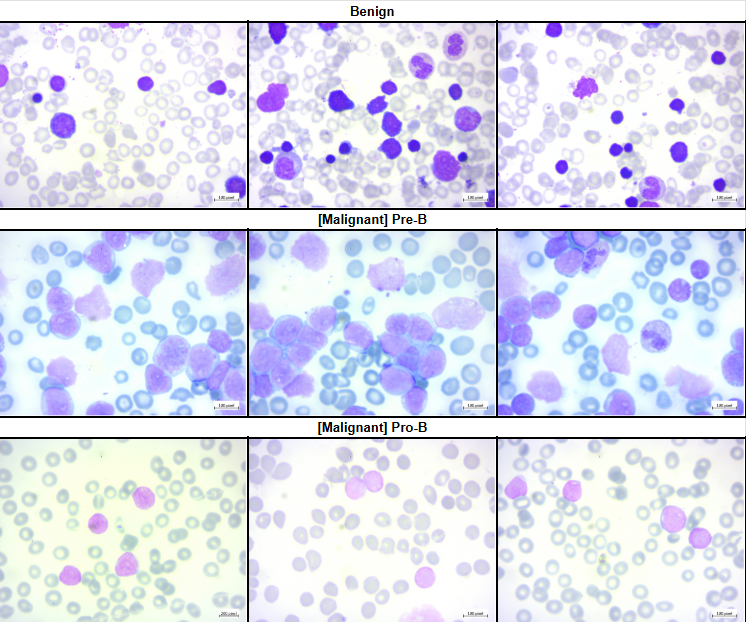

## 🔬 Methodology

### Processing Pipeline Overview


### Data Processing Pipeline


### Key Processing Stages

#### 1. **Advanced Segmentation Block**
Our custom segmentation pipeline isolates individual blast cells from complex bone marrow backgrounds:

| Stage | Benign Sample | Pre-B Malignant | Pro-B Malignant |
|-------|---------------|-----------------|-----------------|
| **Original** → **Segmented** | 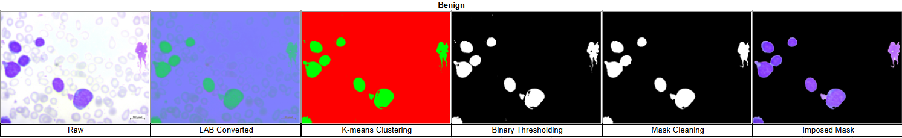 | 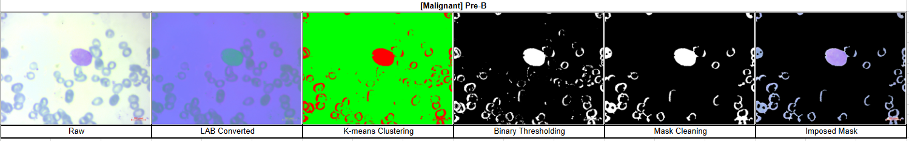 | 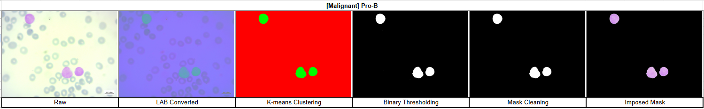 |

**Technical Details**:
- LAB color space conversion for enhanced color separation
- K-means clustering (K=2) on A-channel
- Binary thresholding with morphological operations
- Size filtering (minimum 500px) to remove artifacts

#### 2. **Data Pairing for Dual-Channel Models**
For dual-input architectures, we create paired original-mask combinations:

| Benign | Pre-B Malignant | Pro-B Malignant |
|--------|-----------------|-----------------|
| 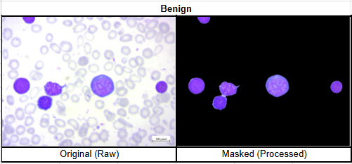 | 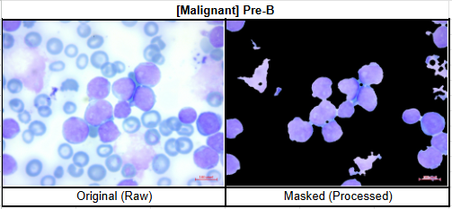 | 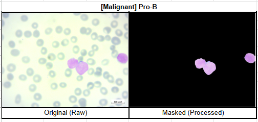 |

#### 3. **Data Augmentation & Balancing**
- **Techniques**: Horizontal and vertical flips
- **Result**: Perfect class balance (811 samples per class)
- **Applied to**: Training set only (prevents data leakage)

## 🤖 Model Architectures

We benchmarked **7 state-of-the-art architectures** across three categories:

### Architecture Comparison

| Category | Model | Parameters | Trainable | Input Type |
|----------|-------|------------|-----------|------------|
| **CNN (Transfer Learning)** | EfficientNet-B0 | 4.38M | 0.33M | Mask only |
| | MobileNetV2 | 2.59M | 0.33M | Mask only |
| | NASNet-Mobile | ImageNet preset | Custom | Mask only |
| **Dual-Channel CNN** | Dual-MobileNetV2 | 3.70M | 1.44M | Original + Mask |
| **YOLO Family** | YOLOv8-n | 1.82M | All | Mask only |
| | **YOLOv11-n** ⭐ | **1.63M** | All | Mask only |
| | YOLOv12-n | 1.82M | All | Mask only |

## 📈 Performance Results

### Overall Model Performance Ranking

| Rank | Model | Test Accuracy | Parameters | Key Strength |
|------|-------|--------------|------------|--------------|
| **1** | **YOLOv11-n** ⭐ | **100%** | **1.63M** | Best efficiency |
| 1 | YOLOv8-n | 100% | 1.82M | Perfect accuracy |
| 1 | YOLOv12-n | 100% | 1.82M | Latest architecture |
| 4 | MobileNetV2 | 99.1% | 2.59M | Good accuracy |
| 4 | Dual-MobileNetV2 | 99.1% | 3.70M | Dual input |
| 6 | NASNet-Mobile | ~99% | Preset | NAS optimized |
| 7 | EfficientNet-B0 | 35.1% | 4.38M | Underperformed |

### Visual Performance Comparisons

#### CNN Models Performance
| EfficientNet-B0 | MobileNetV2 | NASNet-Mobile |
|-----------------|-------------|---------------|
|  | 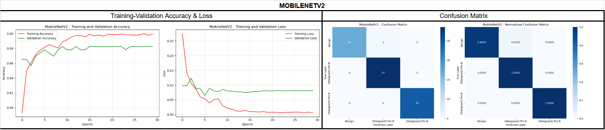 | 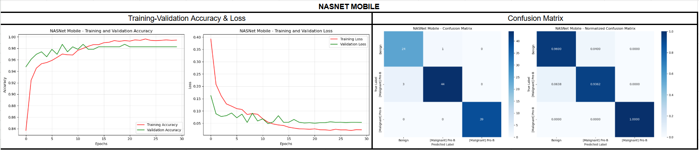 |

#### Dual-Channel Model
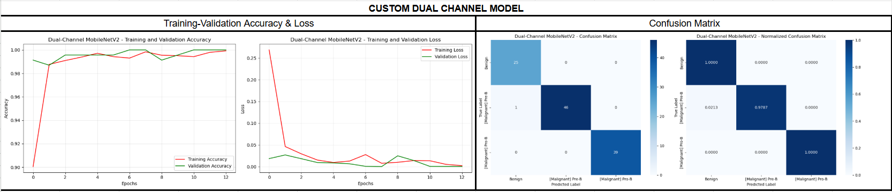

#### YOLO Models Performance
| YOLOv8-n | YOLOv11-n | YOLOv12-n |
|----------|-----------|-----------|
| 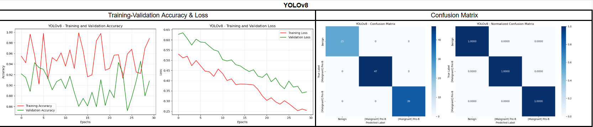 | 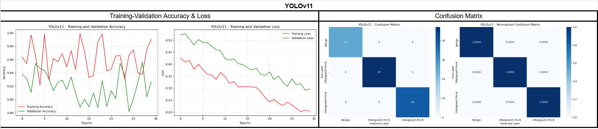 | 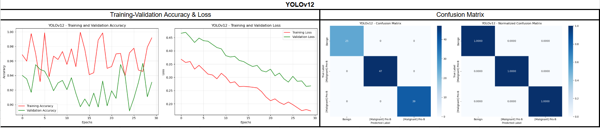 |

### Test Set Performance Summary
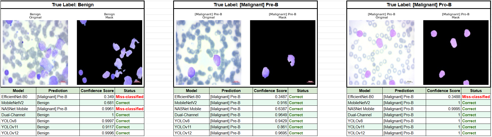

## 🎯 Key Findings

1. **Perfect Classification Achieved**: All YOLO models achieved 100% accuracy on test data
2. **Segmentation is Critical**: Mask-only input captures all necessary diagnostic features
3. **YOLOv11-n is Optimal**: Best accuracy-to-parameter ratio (1.63M params, 100% accuracy)
4. **Dual-Channel No Benefit**: Adding original images to masks provides no performance gain
5. **Clinical Viability**: >0.91 confidence scores suggest readiness for clinical validation

## 💻 Technical Implementation

### Training Configuration
```python
# Global parameters
BATCH_SIZE = 32
IMAGE_SIZE = (224, 224)
LEARNING_RATE = 0.001

# Data splits
TRAIN_SPLIT = 0.85  # 85%
VAL_SPLIT = 0.10    # 10%
TEST_SPLIT = 0.05   # 5%

# Model-specific
CNN_EPOCHS = 30
YOLO_EPOCHS = 23  # Early stopped
```

### Requirements
- Python 3.8+
- TensorFlow 2.x
- Ultralytics YOLOv8
- OpenCV
- scikit-learn
- NumPy, Pandas, Matplotlib

## 📁 Project Structure

```
leukemia-classification/
│
├── docs/                          # Technical documentation
│   ├── [Technical Documentation] Leukemia Classification.docx
│   ├── [PROCESSING PIPELINE] Leukemia Classification.docx
│   └── [Project Presentation] Leukemia Classification.pdf
│
├── diagram-flow/                  # Process flow diagrams
│   ├── [Diagram-flow] Leukemia.drawio.png
│   └── [Processing Diagram-flow] Leukemia Classification.png
│
├── img/                          # Visualization images
│   ├── sample-*.png             # Data samples
│   └── model-performance-*.png  # Performance plots
│
├── [Summary Table] Leukemia Classification.xlsx  # Results summary
└── README.md                     # This file
```

## 🏥 Clinical Implications

This project demonstrates the feasibility of automated leukemia cell classification for:
- **Rapid screening** in resource-limited settings
- **Second-opinion systems** for pathologists
- **Training tools** for medical professionals
- **Point-of-care diagnostics** using edge devices

## 🚀 Future Improvements

1. **External validation** on datasets from different medical centers
2. **Explainable AI** techniques for clinical interpretability
3. **Real-time inference** optimization for microscopy integration
4. **Multi-class expansion** to include more leukemia subtypes
5. **Uncertainty quantification** for borderline cases

## 📊 Summary Table

Detailed results and model comparisons are available in:
`[Summary Table] Leukemia Classification.xlsx`

## 🔬 Research Applications

This work contributes to:
- Medical image analysis benchmarking
- Transfer learning in healthcare
- Edge AI for diagnostics
- Computer-aided diagnosis (CAD) systems

## 📝 Citation

If you use this work in your research, please cite:
```bibtex
@misc{leukemia-classification-2024,
  author = {Zaky Ashari},
  title = {Leukemia Cell Classification Using Deep Learning},
  year = {2024},
  publisher = {GitHub},
  url = {https://github.com/zashari/leukemia-classification}
}
```

## 🙏 Acknowledgments

- Kaggle dataset contributors
- Medical imaging community
- Open-source deep learning frameworks

## 📄 License

This project is for educational and research purposes. Please ensure proper ethical approval for any clinical applications.

---
*Developed with focus on advancing AI-assisted medical diagnostics*